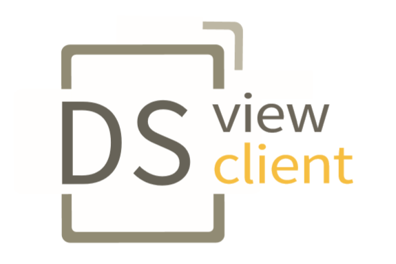

//:stylesheet: custom.css

= [heading]#Digital Signage VIEW CLIENT# 

* Kurzbeschreibung des Projekts:
+
An der HTL Leonding gibt es ein Digital-Signage-System, welches mit einem Open-Source Produkt betrieben wird.
Neben diesem CMS gibt es auch noch einen Client.
Wir überprüfen die REST-Schnittstellen des CMS bei neuen Produkt
Releases, sodass der Client weiterhin funktionniert.

---
=== Links
* Link zum Angular Webclient (Originalprojekt): +
+
https://github.com/dispway/ng-weblient

* Link zum temporären Test-Repo für den Angular Client:
+
https://github.com/florianschickmair/NgClientRestTest

